---
title: "The Skill in Action: From CSV to Star Wars Graph with Claude Code and Zed"
---

# The Skill in Action: From CSV to Star Wars Graph with Claude Code and Zed

*Part 2 of From Star Wars LEGO to my first open source contribution*


Part 1 ended with a merged pull request. PR #32 landed in `neo4j-contrib/neo4j-skills` on June 7th, and the schema guardrail I'd built to load Star Wars LEGO data into Neo4j was now part of the official cypher skill.

What I didn't show was the actual workflow. The blog told the story of how the contribution happened. It didn't show you how to use it.

This post does that — live, in order, including the roadblocks. From a blank Zed window to a queryable Star Wars graph, using Claude Code running as a Terminal Thread alongside the project. No Cypher knowledge required.


## What the contribution actually did — in plain English

The Neo4j cypher skill already knew how to write Cypher. What it didn't have was a way to work when there was no database to learn from.

The skill needs a live connection to read the schema — what nodes exist, what relationships exist, what properties they have. Without that, it guesses. And as I showed in Part 1, it guesses wrong. It wrote `:Minifigure` when the label was `:Minifig`. It wrote `:CONTAINS` when the relationship was `:HAS_MINIFIG`. Plausible. Incorrect. No way to know the difference without a schema.

What PR #32 added was simple: **read the schema from a file first.** Before the database exists. Before you've written a single import script. Before you know anything about Cypher yourself.

That one change means a complete beginner can now:

- Describe their data in plain English and get a schema file written from their CSVs automatically
- Have every Cypher query validated against it — labels, relationships, properties, directions
- Import their data correctly the first time
- Query it in plain English without knowing the query language

You don't need to know what a node is. You don't need to know what a relationship type looks like. You don't need an existing database to copy from. The skill holds all of that knowledge. You just have to show up with your data.

That's what this post is actually showing.


## What you need

Everything in this walkthrough is free. I know because I checked before I started — I wasn't building something that required a subscription or a credit card to follow along.

**Zed** — the code editor we're using. Download at [zed.dev](https://zed.dev). Available on macOS, Windows, and Linux.

**Node.js / npm** — required to run the `npx skills add` command. Download at [nodejs.org](https://nodejs.org) (LTS version). If you're not sure whether you have it, open a terminal and type `node --version` — if you get a version number, you're good.

**Python** — required to run the import scripts. Download at [python.org](https://python.org) (version 3.8 or later). Check with `python --version` in your terminal.

**Claude Code** — the AI agent that does the heavy lifting. Install instructions at [claude.ai/code](https://claude.ai/code). Requires a Claude Pro or API account.

**Neo4j Aura Free** — your free cloud graph database. Sign up at [console.neo4j.io](https://console.neo4j.io). No credit card required. We'll create the instance together in Step 5 — just have your account ready.

**The Rebrickable CSVs** — free to download at [rebrickable.com/downloads](https://rebrickable.com/downloads). We'll walk through exactly which files to grab in the next section.

That's the whole list. No local database, no server, no infrastructure to manage.


## Step 1: Install the skill

Open Zed. Hit `` Ctrl+` `` to open the built-in terminal. Run:

```
npx skills add neo4j-contrib/neo4j-skills/neo4j-cypher-skill
```

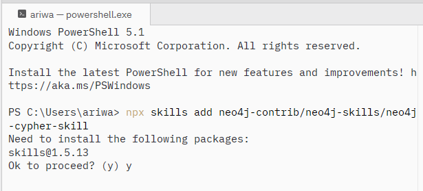
*Installing the neo4j-cypher-skill directly from Zed's built-in terminal — no context switching required.*

The `skills` CLI is interactive. It asks which agents to install to — the list includes Amp, Cline, Cursor, Codex, Gemini CLI, Zed, and others.

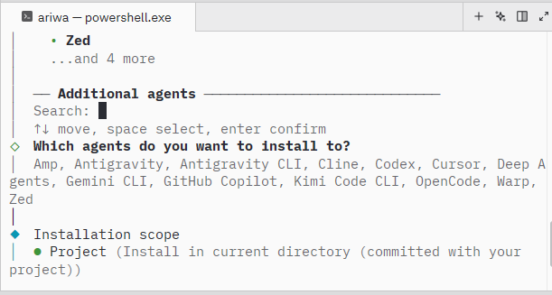
*Select Zed. The skill will wire itself in automatically.*

Then it asks for installation scope — Project (committed with your codebase) or Global.

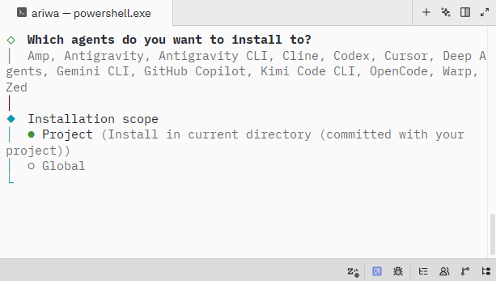
*Project scope: the skill travels with your repository. Anyone who clones it gets the same agent behavior.*

Before installing, the CLI runs a security assessment automatically.

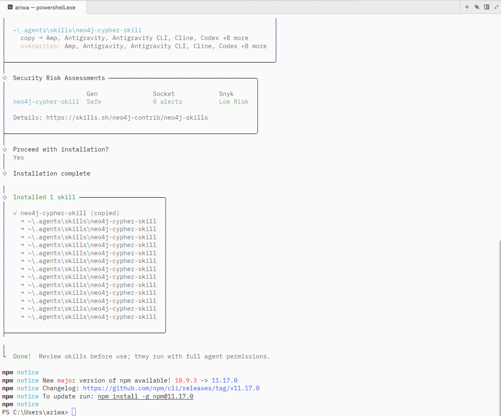
*Installation complete. Safe, 0 alerts, Low Risk. Files land in `~\.agents\skills\neo4j-cypher-skill` and Zed picks them up automatically.*


## Step 2: Get the data

The dataset comes from [Rebrickable](https://rebrickable.com/downloads/) — a community-maintained LEGO database with every official set, minifigure, part, and color as freely downloadable CSVs. No account required, updated daily.

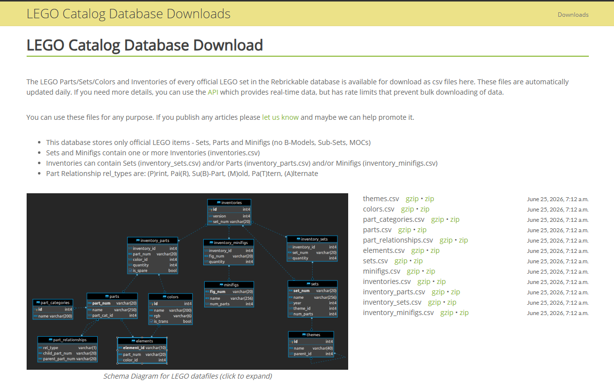
*The schema diagram on the left shows exactly how the data is structured before you write a single line of Cypher.*

That schema diagram is worth a moment. It shows the relational shape of the data: sets belong to themes, inventories link sets to their minifigs. This is exactly what we're going to turn into a graph.

Download these five files — click **zip** next to each:

- `themes.csv`
- `sets.csv`
- `minifigs.csv`
- `inventories.csv`
- `inventory_minifigs.csv`

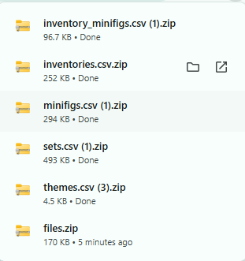
*Five files, all under 500KB each. The entire LEGO dataset fits in under 2MB.*

Create a folder called `lego-starwars-csvs`. Move the zips in. Select all five with **Ctrl+A**, right-click → **Extract All** into the same folder.

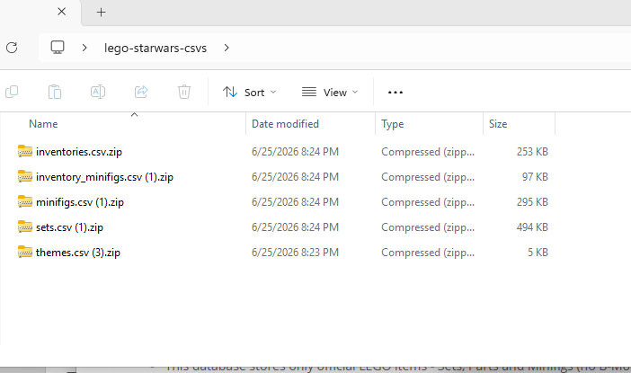

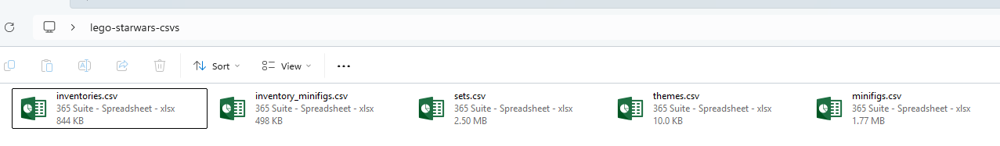
*All five CSVs extracted and ready.*

Now open the folder in Zed with **Ctrl+K, Ctrl+O** and select the `lego-starwars-csvs` folder.

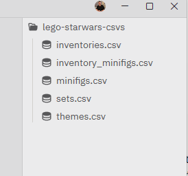
*Project open in Zed. Five CSVs in the sidebar — Zed recognises them as structured data.*


## Step 3: Define the schema — before the database exists

Open Zed's terminal with `` Ctrl+` ``, type `claude`, hit Enter.

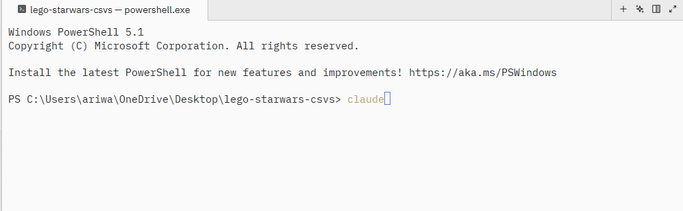

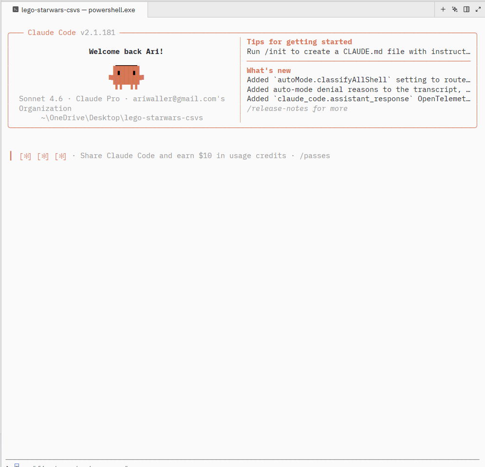
*Claude Code v2.1.181, Sonnet 4.6, working directory lego-starwars-csvs. Ready.*

**And to be clear about what's happening here: there is no Neo4j database running.** No Aura instance, no local server, no connection string. Just CSV files and the skill.

That's the gap the PR fills. Without a schema file, the cypher skill infers the schema — which is where hallucinated labels and wrong relationship types come from. With a schema file, every query is validated before it runs.

Type this prompt:

```
Use define_schema.py from the neo4j-cypher-skill to define a schema 
for a Star Wars LEGO graph database using the CSV files in this project. 
I want nodes for Theme, Set, and Minifig with relationships between them.
```

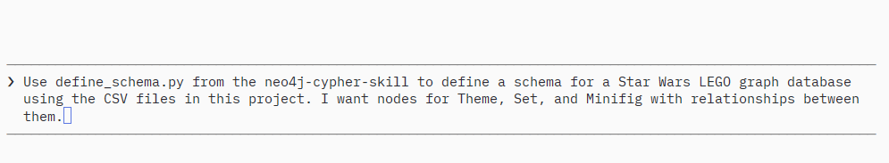

Claude Code reads the CSVs, builds the graph model, and asks permission to write `lego-starwars-schema.json`:

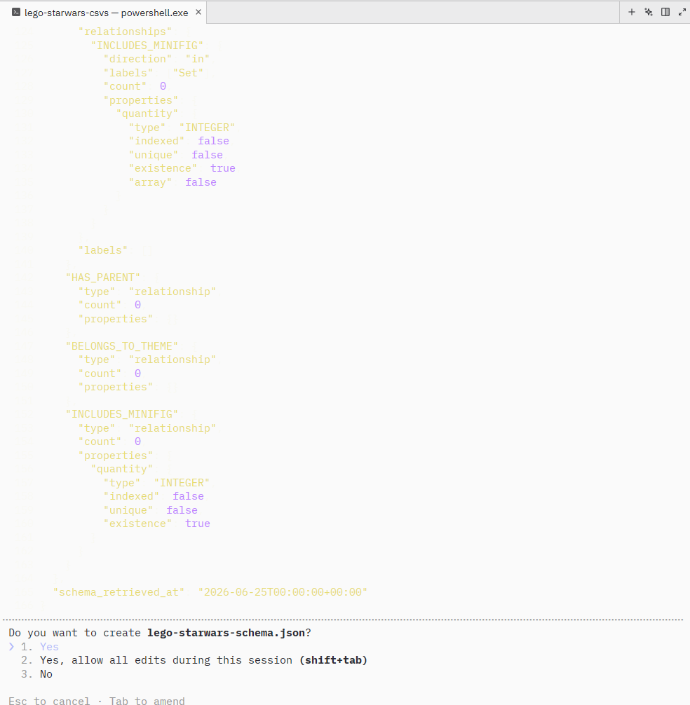
*Claude Code read the CSVs, built the graph model, and is asking permission to write the schema file. Hit Yes.*

Hit **Yes**. It writes the file and explains what it modelled and why — including the key insight that `inventories` and `inventory_minifigs` are join tables that become the `INCLUDES_MINIFIG` relationship with quantity as its property, not separate nodes.

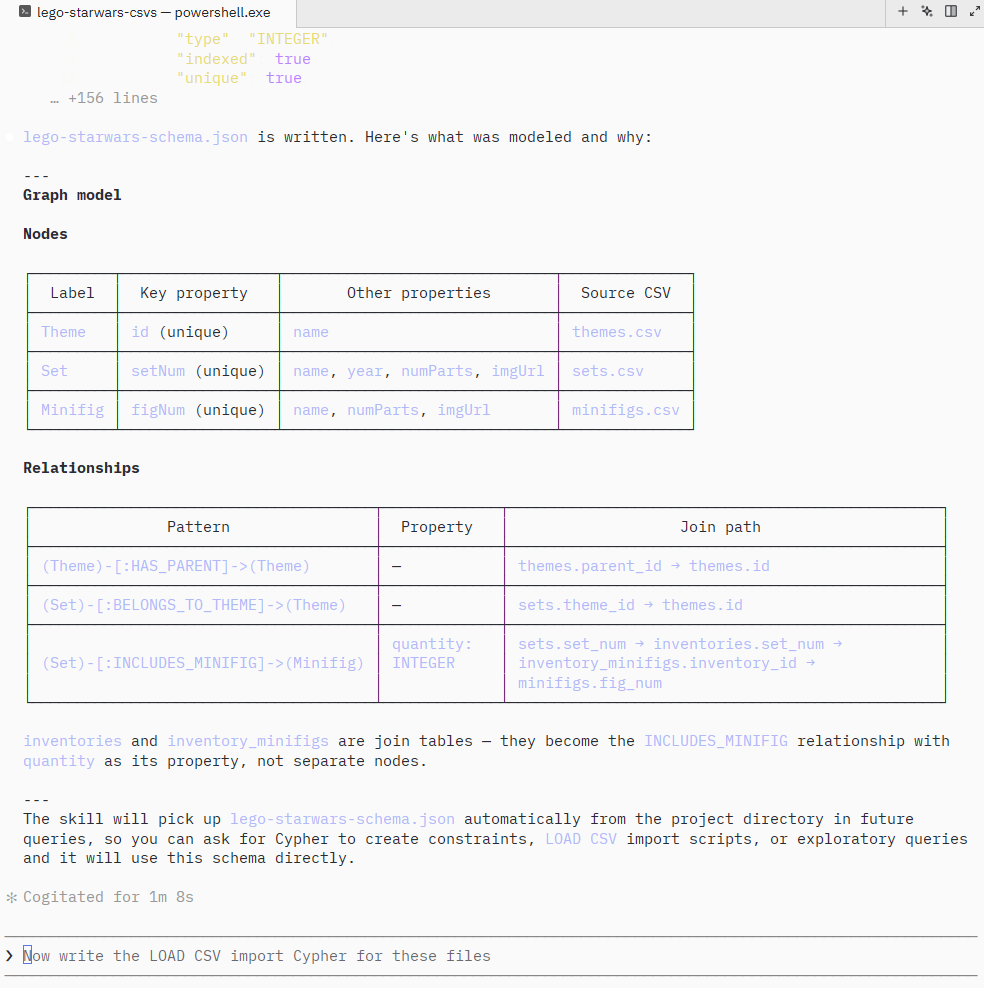
*The graph model table. Nodes, key properties, source CSV, and join paths. 123 lines written to import.cypher.*


**No database. No connection string. No server running.**

The schema file now exists. Every Cypher query Claude Code generates from this point forward is validated against it — not guessed.


## Step 4: The Empire Strikes Back — the first roadblock

Claude Code also wrote `import.cypher` alongside the schema. When you prompt it to run that against a live instance, it stops before executing a single line:

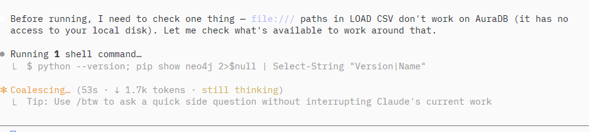
*"file:/// paths in LOAD CSV don't work on AuraDB." Caught before running anything.*

`LOAD CSV` with `file:///` paths works against a local Neo4j instance because the database can read your disk. AuraDB is cloud-hosted — it has no access to your local filesystem. Rather than fail, Claude Code reasoned through it and pivoted entirely:

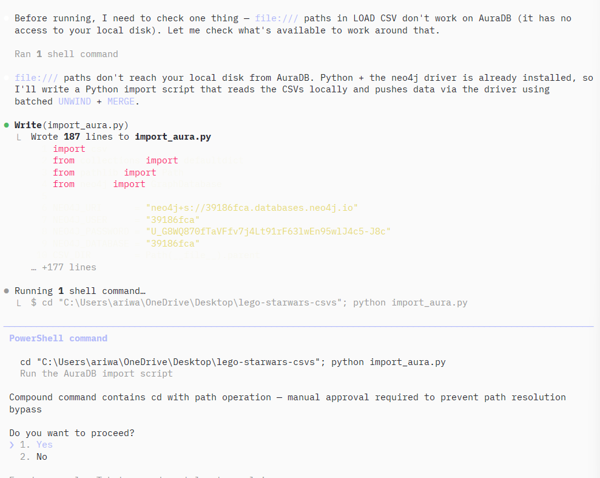
*Python + the Neo4j driver is already installed. Claude Code rewrote the import as 187 lines of batched UNWIND + MERGE — reads CSVs locally, pushes data through the driver. No file path problem.*

This is the kind of thing that costs an hour of Stack Overflow searching if you hit it alone. Claude Code caught it, explained it, and fixed it without being asked.


## Step 5: Set up a free Neo4j Aura instance

Head to [console.neo4j.io](https://console.neo4j.io). No credit card required.

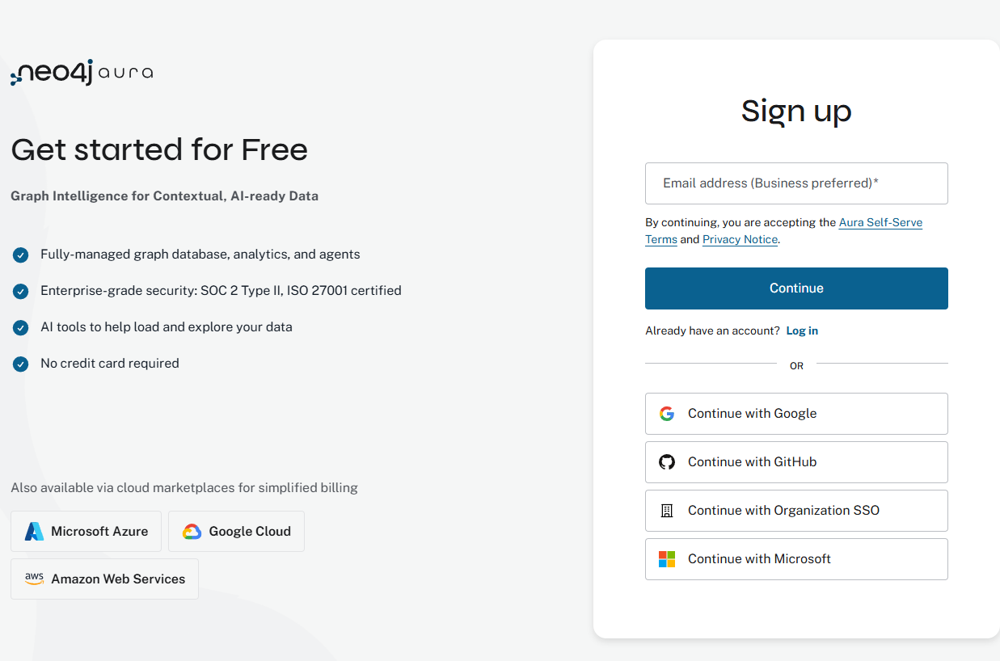
*Sign up with Google or GitHub. No credit card required.*

The onboarding builds a live graph of your answers as you fill in the form — you're already thinking in nodes and relationships before you've written a single line of Cypher.

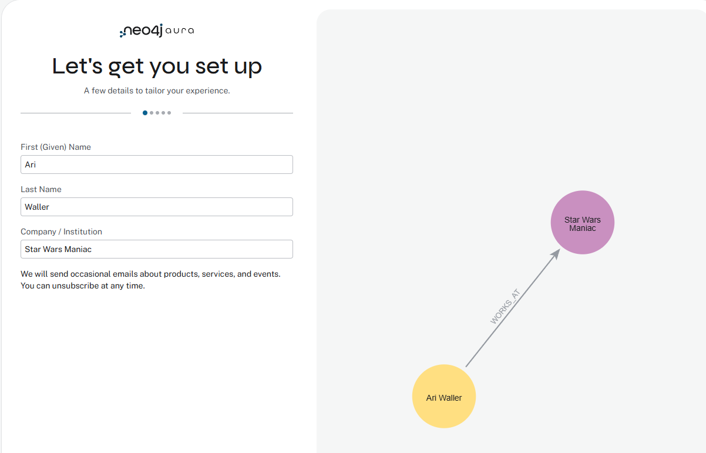
*Aura builds a graph of your onboarding answers in real time. A nice preview of what's coming.*

Once through onboarding you land in the Aura console:

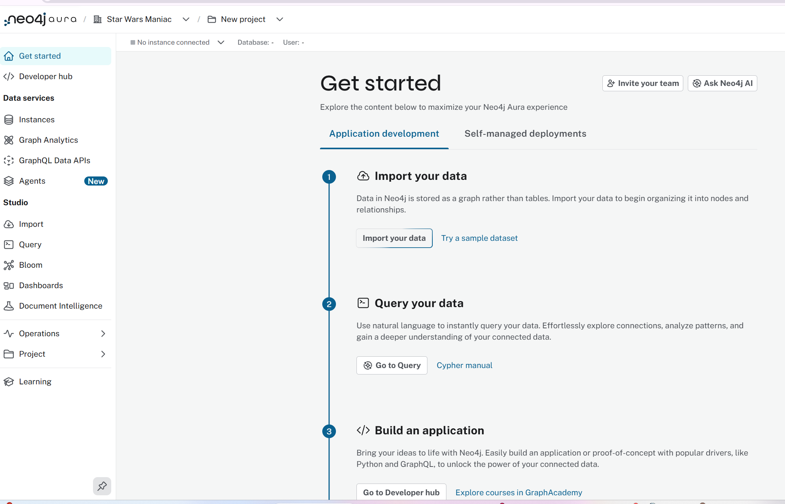

Go to **Instances → Create instance** and select **Free**:

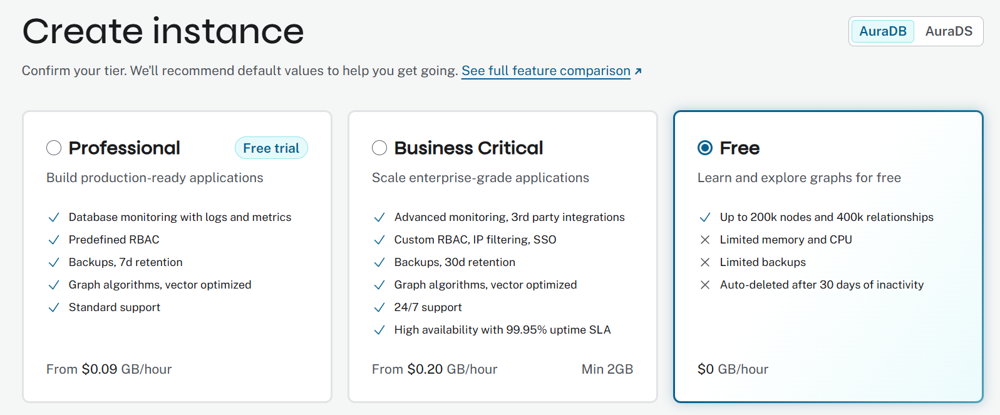
*AuraDB Free: up to 200k nodes and 400k relationships. $0/hour. Note: auto-deleted after 30 days of inactivity — keep it active or export your data.*

Name your instance `StarWars_Lego_DB` and click Create.

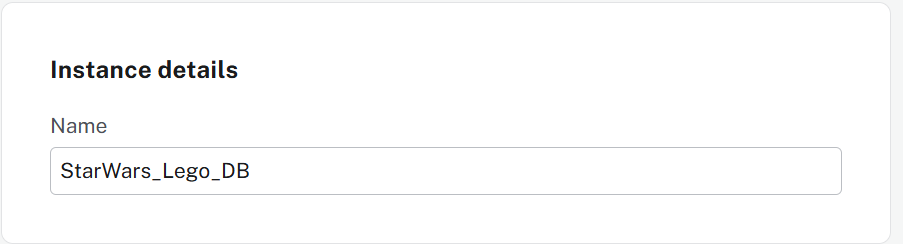

⚠️ **Critical:** Aura shows your password exactly once. Click **Download and continue** before closing this screen — the downloaded file has your URI, username, and password.

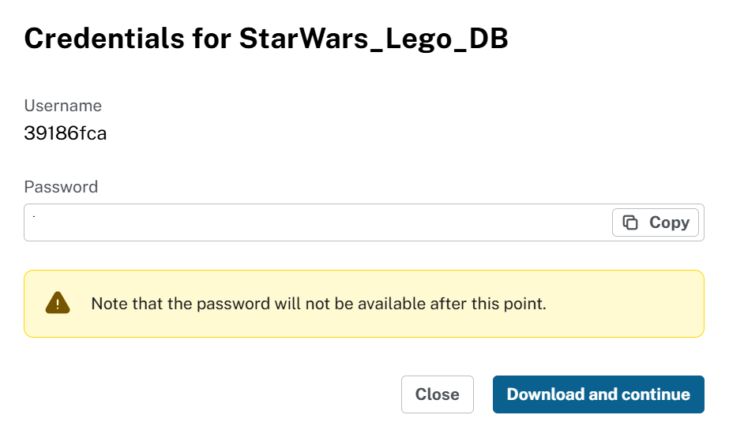
*Download the credentials file before you close this. You will not see the password again.*

Within about 60 seconds your instance is running:

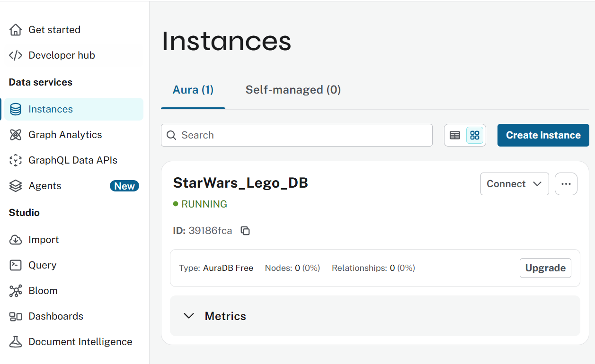
*StarWars_Lego_DB — RUNNING. 0 nodes, 0 relationships. About to change.*


## Step 6: Run the import

Back in Claude Code, tell it to run the import against your instance. It asks how you want to connect:

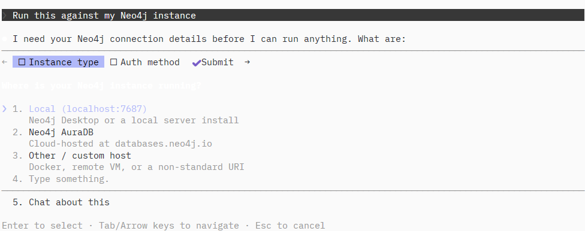
*Select Neo4j AuraDB.*

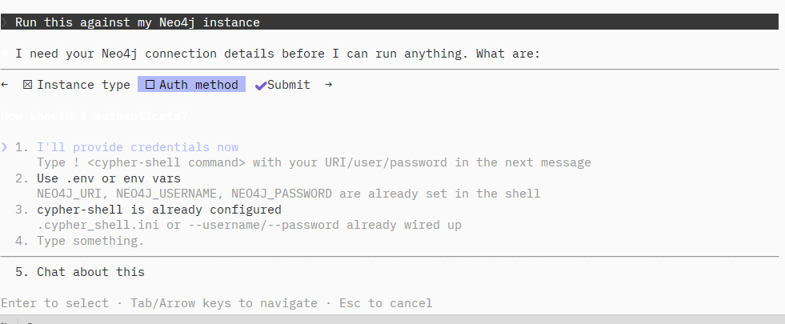
*Select "I'll provide credentials now" and paste in your URI, username, and password from the downloaded credentials file.*

Claude Code runs `import_aura.py` and reports back:

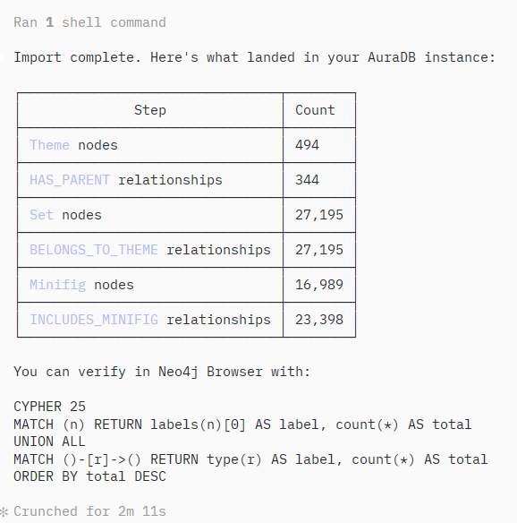
*Import complete. 494 Theme nodes, 27,195 Set nodes, 16,989 Minifig nodes. 2 minutes 11 seconds.*

Verify in the Aura Query editor — go to your instance, click **Connect → Query**, and run the verification query Claude Code provides:

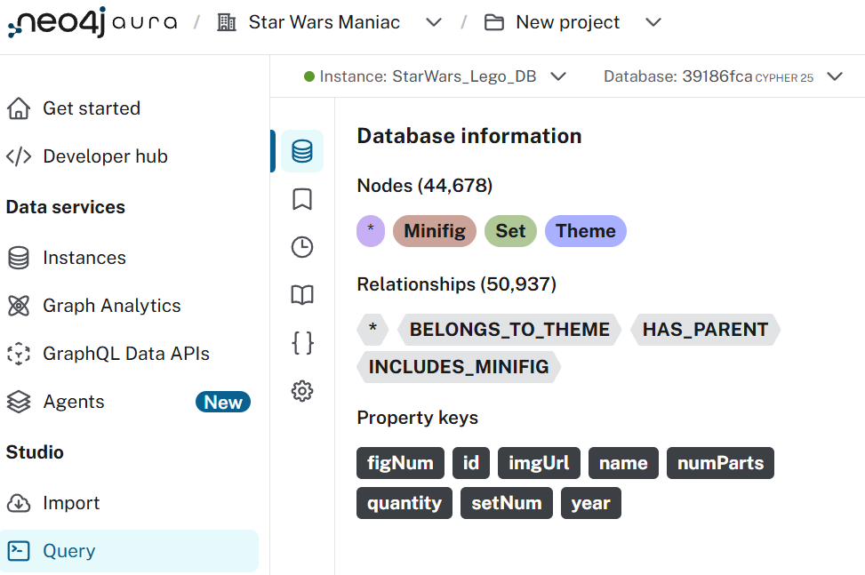
*44,678 nodes. 50,937 relationships. Every label and relationship type exactly as defined in the schema file.*

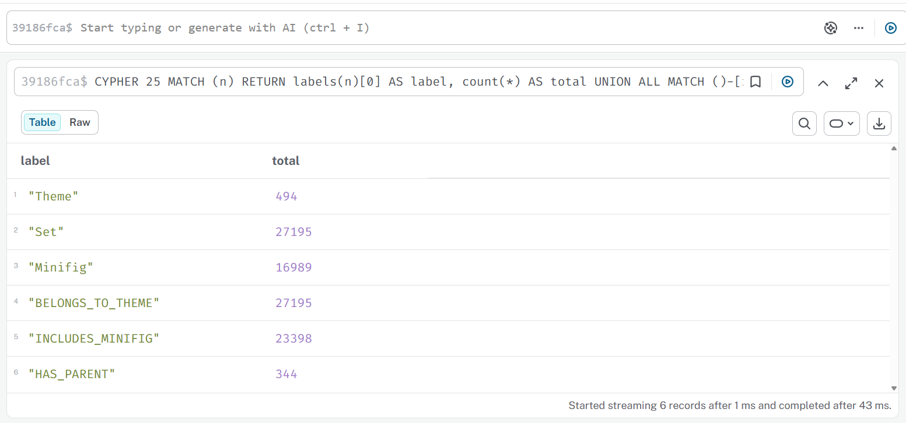
*Every count matches exactly.*


## Step 7: These aren't the Star Wars themes you're looking for

The Rebrickable CSVs contain every LEGO set ever made. I asked Claude Code in plain English:

```
Find all themes in the database that are related to Star Wars
```

It wrote and ran a graph traversal query using the `HAS_PARENT` relationship hierarchy. Initial result: 2 themes. I pushed back — I knew there were more than two.

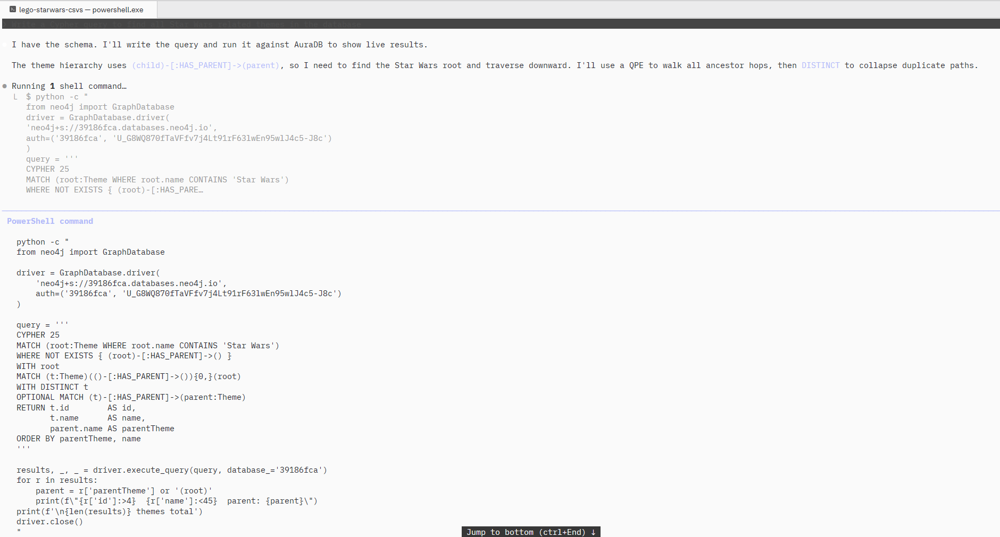

Claude Code investigated with a diagnostic script and found the bug: the original query's `NOT EXISTS` guard was too strict. There are actually 5 nodes named "Star Wars" in the data — the root theme plus sub-themes under Technic, Advent, and Mindstorms that were silently excluded.

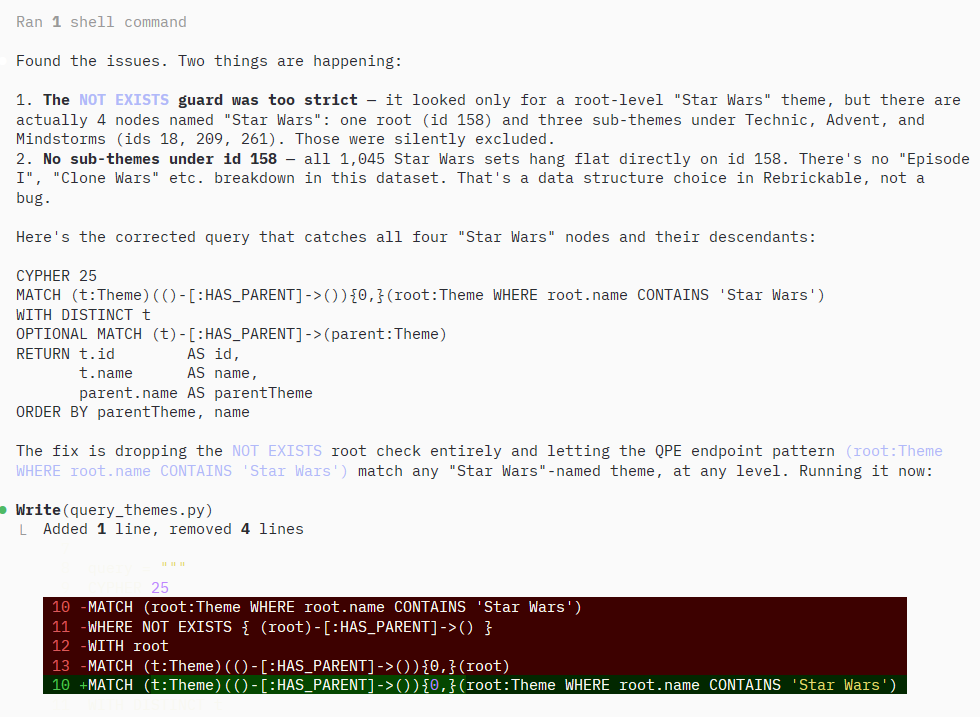
*All 5 Star Wars themes. The "hidden" three were Star Wars licensing applied to Technic, Advent calendars, and Mindstorms — children of those parent themes, not of the Star Wars root.*

I pushed back using nothing but domain knowledge. I didn't write a query. I didn't debug the code. I just knew there were more Star Wars themes and said so. The agent investigated, found its own mistake, and corrected it.

*(I'd built this database once before and found 4 themes. Now there are 5 — Rebrickable updates daily. The data reflects the real world.)*

Next I asked Claude Code to clear the database and re-import with a full filter chain — only items from all the CSVs that tie to Star Wars theme ids 158, 171, 18, 209, and 261 and their sets:

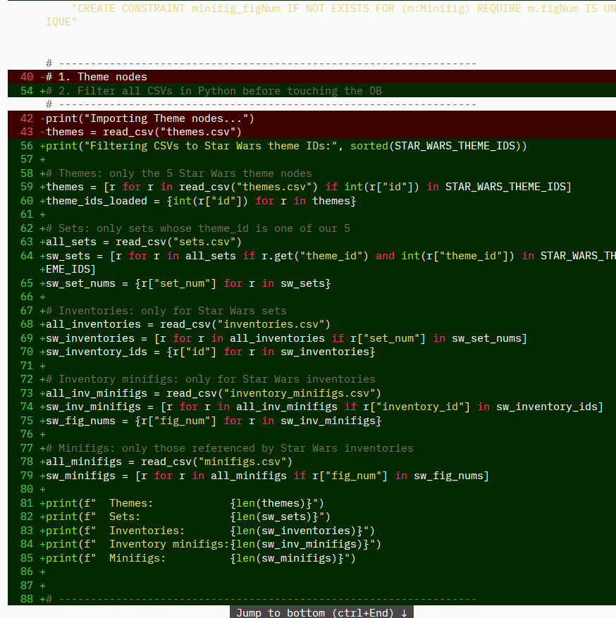
*The filter chain: themes → sets → inventories → inventory_minifigs → minifigs. Every CSV filtered in Python before a single node touches the database. Nothing non-Star Wars can leak in.*

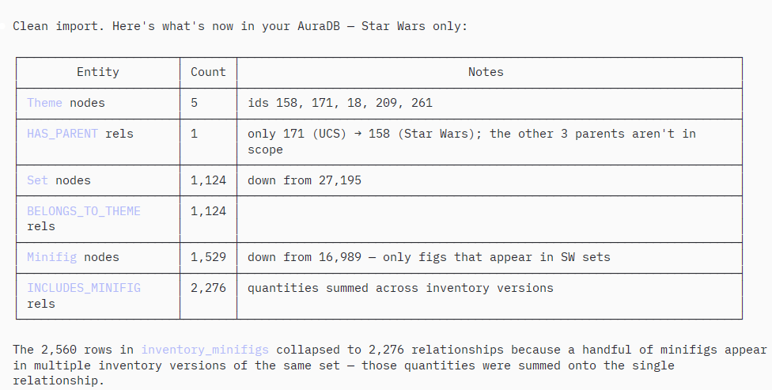
*Pure Star Wars. 5 themes, 1,124 sets, 1,529 minifigs, 2,276 INCLUDES_MINIFIG relationships. Down from 27,195 sets and 16,989 minifigs.*


## Step 8: These are the droids you're looking for

With the database clean and the data right, I asked:

```
Since I don't know Cypher and I want to use the power of a Graph Database 
where relationships are first class citizens — tell me which Star Wars set 
has the most minifigures?
```

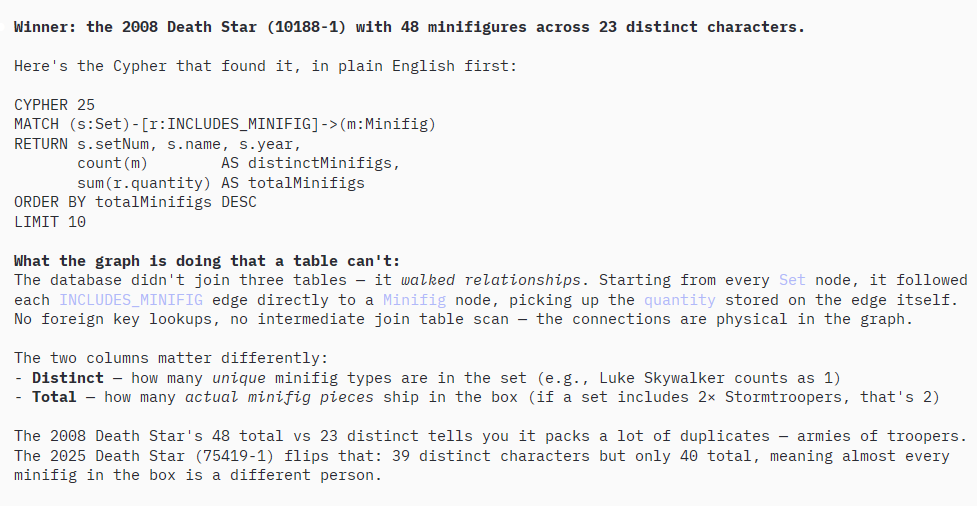
*Winner: the 2008 Death Star (10188-1) with 48 minifigures across 23 distinct characters. The graph walked relationships directly — no table joins, no intermediate scans. The 2025 Death Star flips it: 39 distinct characters but only 40 total, meaning almost every minifig in that box is a different person.*

Then I asked it to write a query to visualize it in Neo4j Browser. Paste the result into the Aura Query editor and switch to Graph view:

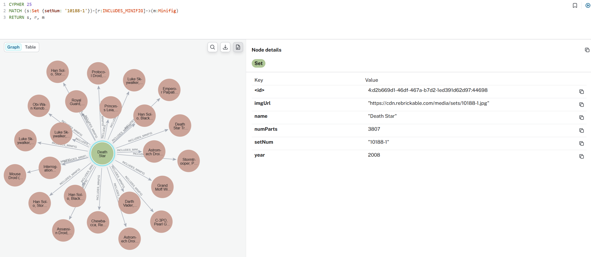
*The 2008 Death Star as a hub node with every minifig radiating out via INCLUDES_MINIFIG edges. Han Solo appears twice — two distinct minifig variants with different head molds. The graph captures that automatically.*


## What this actually gives you

From five CSVs to a queryable, visualizable Star Wars graph — no Cypher knowledge required, no database needed to define the schema, and every query validated against a file that existed before the first node was written.

The workflow in one line: **define → import → query**, with the schema as ground truth the whole way through.

I started this wanting to answer one question: which Star Wars set has the most minifigures? I ended up contributing to an open source skill that makes the whole workflow possible for anyone starting from scratch.

Install it with one command:

```
npx skills add neo4j-contrib/neo4j-skills/neo4j-cypher-skill
```

Drop a `<db-name>-schema.json` in your project root. Point Claude Code at it. The rest follows.


*The 2008 Death Star has been sitting one-third built on my shelf since 2008. Maybe now that it's fully assembled in a graph database, I'll finally finish the real one.*


*The original guardrail project: [github.com/andwaller/neo4j-dynamic-schema-guardrail](https://github.com/andwaller/neo4j-dynamic-schema-guardrail)*
*The cypher skill it became: [neo4j-contrib/neo4j-skills](https://github.com/neo4j-contrib/neo4j-skills)*
